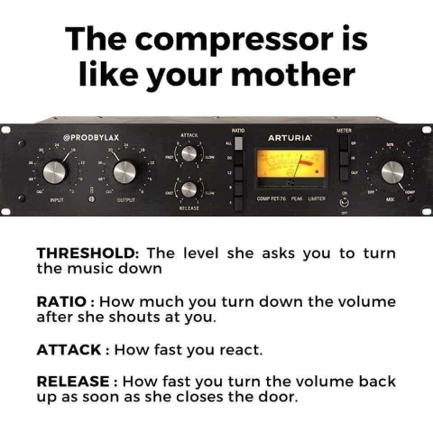

### Контроли и параметри на компресора

Има една шега, която обикаля Интернет и обяснява работата на компресора по много
разбирем начин, тя започва така - „Компресорът е като майка ти“ и продължава:
threshold е силата на музиката, при която майка ти нахлува в стаята и започва да
крещи; ratio e с колко намаляваш силата на музиката, след като майка ти е
започнала да крещи; attack time е колко бързо намаляваш музиката след като майка
ти е нахлула в стаята; release time е колко бързо връщаш силата на музиката
обратно до първоначалното ниво след като майка ти напусне стаята.

Това е едно сравнително точно, но доста опростено обяснение. Освен threshold,
ratio, attack time и release time, компресорите имат още knee и output gain.
Независимо дали използвате хардуерен компресор или дигитален плъгин към DAW, с
който обработвате записите си, тези контроли и параметри са част от него.

#### Праг (Threshold)

Прагът задава нивото на сигнала, при което се включва ефектът на
компресия.  Само когато нивото премине над прага, силата на сгнала ще бъде намалена.
Ако нивото на прага е зададено на -10 dB, ще се компресират само пикове на
сигнала, които се простират над това ниво. През останалото време няма да се
извършва компресия и сигналът ще преминава непроменен през компресора.

#### Коляно (Knee)

„Коляното“, или Knee, се отнася до това колко рязко компресорът понижава нивото
на аудио сигнала, преминаващ през него. Обикновено компресорите предлагат избор
между две настройки: „soft knee" и „hard knee". „Меко коляно“ позволява
по-плавно понижаване от „твърдо коляно“. При мекото компресията нараства
плавно с нарастванено на силата на сигнала над прага.  

#### Време за атака (Attack time)

Това е времето за достигане на максимална компресия на сигнала след надвишаване
на праговото ниво. По-бързите времена за атака обикновено са между 20 и 800 μs
(микросекунди), докато по-бавните времена обикновено варират от 10 до 100 ms
(милисекунди). Бързото време за атака може да предизвика изкривяване на звука,
като модифицира бавните нискочестотни форми на вълната, например ако цикъл от 100
Hz трае 10 ms, тогава време за атака от 1 ms ще промени формата на вълната и ще
предизвика изкривяване. Времето за атака трябва да е максимално бързо, но без да
предизвиква изкривяване на звука.

#### Време за освобождаване (Release time)

Това, естествено, е буквално обратното на времето за атака. По-конкретно, това е
времето, необходимо на сигнала да премине от компресирано състояние обратно към
първоначалния некомпресиран сигнал. Времето за освобождаване е значително
по-дълго от времето за атака, като обикновено варира от 40-60 ms до 2-5 секунди.

За постигане на идеалното качество на звука времето за освобождаване трябва да
бъде възможно най-кратко, без да се създава ефект на "пулсиране", който се
причинява от циклично активиране и деактивиране на компресията. Например ако
времето за освобождаване е зададено твърде кратко преминаването на компресора
между активно и неактивно състояние ще бъде отчетливо доловимо и неприятно
"осезамо" за ухото на слушателя.

#### Съотношение на компресия (Ratio)

Коефициентът на компресия определя степента на понижаване, която да се приложи
към сигнала, когато нивото му навдиши зададения праг. Съотношение 1:1 (едно към
едно) означава, че сигнала минава през компресора без никаква промяна.
Коефициентите на компресия се изразяват в децибели, така че съотношението 2:1
показва, че сигнал, надвишаващ прага с 2 dB, ще бъде понижен до 1 dB над прага
или сигнал, надвишаващ прага с 8 dB, ще бъде намален до 4 dB над него и т.н.

Ако съотношение от 3:1 може да се счита за умерено компресиране, то 5:1 би било
средно компресиране, а 8:1 е на границата на силната (прекалената) компресия.
Компресия в съотношения от 20:1 (двадесет към едно) до ∞:1 (безкрайност към
едно) вече не е компресор, а „ограничител“ (limiter) и се използва, за да се
гарантира, че сигнал със сила над зададения праг няма да премине изобщо
по-нататък по веригата.

#### Усилване на изхода (Output gain) 

Въпреки че компресията се прилага, за да направи сигнала по-силен, в
действителност приложеното от компресията затихване на пиковете над прага като
цяло намалява силата на звука на изхода на компресора. Усилването на изхода
(output gain или make-up gain) „компенсира“ затихването, извършено от
компресора.  Качествените компресори имат индикатори за нивото на изхода в dB,
които ще ви помогнат да зададете точното усилване на изхода на компресора.

### Заключение

Използването на компресия може да направи подкаста ви да звучи по-добре, като ви
даде контрол върху максималните нива на звука, за да намалите разликата между
тихите и силните моменти, което пък, като страничен ефект, ще ви позволи да
поддържате по-висока средна сила на звука. Но пък прекаленото компресиране ще
направи подкаста ви да звучи неестестевено. Доброто разбиране на начина на
работа на компресията ще ви даде увереност при използването ѝ.    

[[z:zettels?tag=podcasting/audio/*]]
